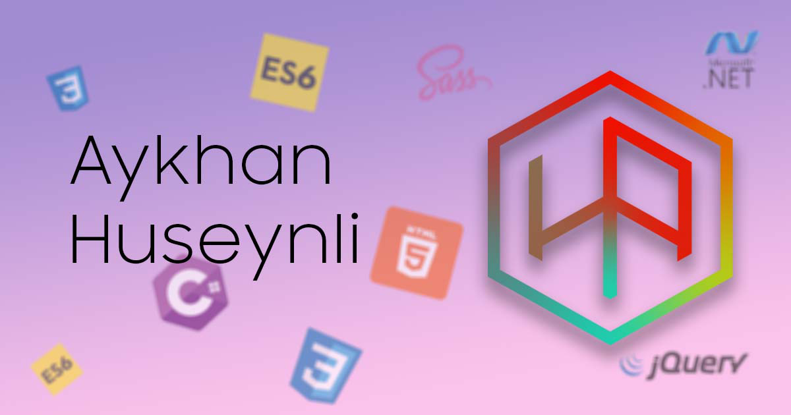

##Aykhan Huseyn

###Sources:

- [Background Animation](https://codepen.io/matthewwilliams/pen/Qbzmzr). 
- [Mac OS Dock](https://fivera.net/create-mac-style-dock-menu-css-example/).
  - (with [CodePen](https://codepen.io/fivera/embed/sdpkn?height=300&type=result&href=sdpkn&user=fivera&safe=true&slug-hash=sdpkn&default-tab=result&animations=run&name=cp_embed_1) link). 
- [Loading CSS](https://codepen.io/werm/pen/BhtLm). 
- [ReadMe.MD](https://gist.github.com/PurpleBooth/109311bb0361f32d87a2)

### Fonts 

I have used only one font in page. 
It is SamSung Sharp Sans. 
You can download it from 
[this](http://fontlar.info) site.

### Cursors 
I have used cursor style called "[Numix](https://github.com/numixproject/numix-cursor-theme)" in my site. 
You can download it from [here](https://www.deviantart.com/alexgal23/art/Numix-Cursors-631491782) and install it.

### Dark mode SVG morph
For animation in dark mode button (Sun transforming to Moon) 
I have used [Animate JS](https://animejs.com/). You can find a lot of 
tutorials on this theme on the internet. 
>Just Google It. 

#### P.S.
In case you want to use effects or something else you like 
in my site, add link to github. All resources are free. Feel free 
to use them, please. 

`
Best Regards
`

 
